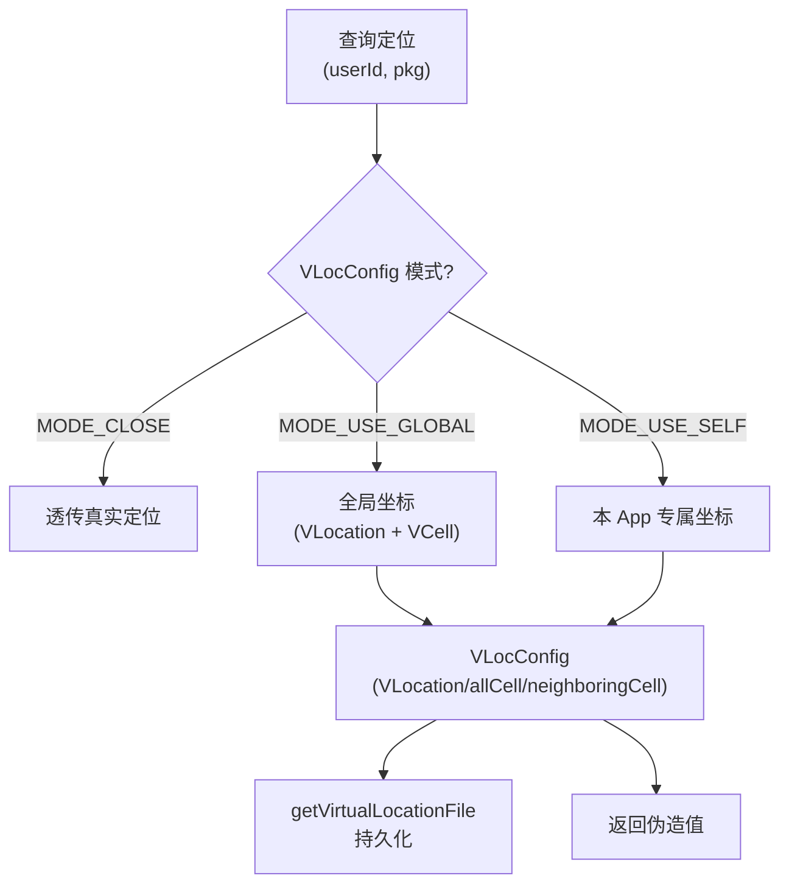

# server/location · 虚拟定位服务

::: tip 源码路径
[`src/main/java/com/lody/virtual/server/location/VirtualLocationService.java`](https://github.com/android-security-engineer/VirtualXposed-skills/blob/vxp/VirtualApp/lib/src/main/java/com/lody/virtual/server/location/VirtualLocationService.java)
:::

`VirtualLocationService` 重新实现定位/基站伪造，按 `userId × 包名` 维度管理配置。详见 [虚拟定位](../../features/virtual-location)。

## 核心机制

- 三种模式：`MODE_CLOSE`（透传真实）/ `MODE_USE_GLOBAL`（全局坐标）/ `MODE_USE_SELF`（本 App 专属坐标）
- `VLocConfig` 持有 `VLocation`（经纬度）+ `VCell`（主基站）+ `allCell`/`neighboringCell`（邻区）
- 配置持久化到 `VEnvironment.getVirtualLocationFile()`
- 客户端 [location 代理](../proxies/location) 转发查询到这里

数据类 `VLocation`/`VCell` 定义在 `remote/vloc/`，跨进程传递。

## 三种定位模式

按 `userId × 包名` 维度管理配置，三种模式覆盖"不伪造/全局伪造/单 App 伪造"。
