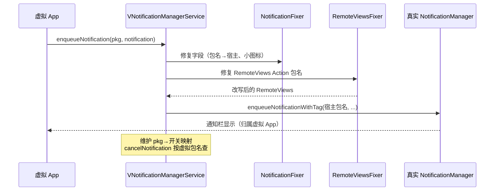
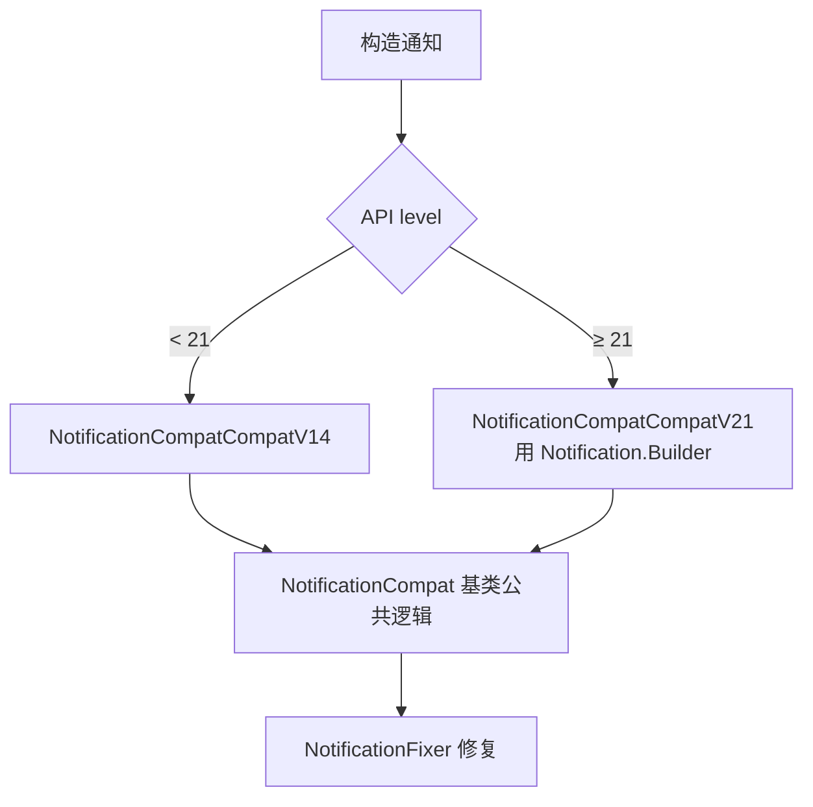
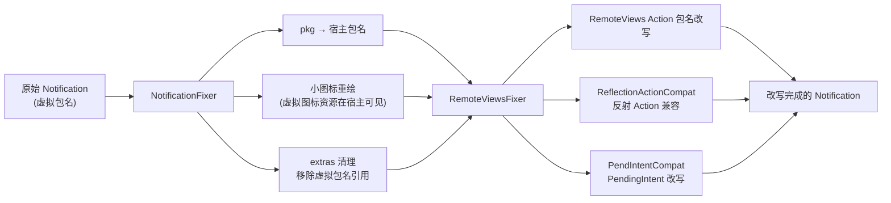

# server/notification · 虚拟通知服务

::: tip 源码路径
[`src/main/java/com/lody/virtual/server/notification/`](https://github.com/android-security-engineer/VirtualXposed-skills/tree/vxp/VirtualApp/lib/src/main/java/com/lody/virtual/server/notification)
:::

`VNotificationManagerService` 重新实现通知管理，让虚拟 App 的通知通过宿主通道显示，且各虚拟 App 通知开关独立。共 **9 个文件**，含大量版本兼容修复。按职责分三组。

## 文件分组

### 主服务

| 文件 | 职责 |
| --- | --- |
| [`VNotificationManagerService.java`](https://github.com/android-security-engineer/VirtualXposed-skills/blob/vxp/VirtualApp/lib/src/main/java/com/lody/virtual/server/notification/VNotificationManagerService.java) | 服务主类，通知入队/取消/查询，按虚拟包名维护开关状态 |

### 修复器族（改写通知内容）

| 文件 | 职责 |
| --- | --- |
| [`NotificationFixer.java`](https://github.com/android-security-engineer/VirtualXposed-skills/blob/vxp/VirtualApp/lib/src/main/java/com/lody/virtual/server/notification/NotificationFixer.java) | 通知字段修复：包名改宿主、小图标重绘、extras 清理 |
| [`RemoteViewsFixer.java`](https://github.com/android-security-engineer/VirtualXposed-skills/blob/vxp/VirtualApp/lib/src/main/java/com/lody/virtual/server/notification/RemoteViewsFixer.java) | RemoteViews 修复：Action 里的包名引用改写为宿主 |
| [`ReflectionActionCompat.java`](https://github.com/android-security-engineer/VirtualXposed-skills/blob/vxp/VirtualApp/lib/src/main/java/com/lody/virtual/server/notification/ReflectionActionCompat.java) | RemoteViews 反射 Action 兼容 |
| [`PendIntentCompat.java`](https://github.com/android-security-engineer/VirtualXposed-skills/blob/vxp/VirtualApp/lib/src/main/java/com/lody/virtual/server/notification/PendIntentCompat.java) | 通知内 PendingIntent 兼容改写 |

### 版本兼容族（按 API 选实现）

| 文件 | 职责 |
| --- | --- |
| [`NotificationCompat.java`](https://github.com/android-security-engineer/VirtualXposed-skills/blob/vxp/VirtualApp/lib/src/main/java/com/lody/virtual/server/notification/NotificationCompat.java) | 兼容基类，按 API 级别选 V14/V21 |
| [`NotificationCompatCompatV14.java`](https://github.com/android-security-engineer/VirtualXposed-skills/blob/vxp/VirtualApp/lib/src/main/java/com/lody/virtual/server/notification/NotificationCompatCompatV14.java) | Android 4.x（API 14-20）通知兼容 |
| [`NotificationCompatCompatV21.java`](https://github.com/android-security-engineer/VirtualXposed-skills/blob/vxp/VirtualApp/lib/src/main/java/com/lody/virtual/server/notification/NotificationCompatCompatV21.java) | Android 5.0+（API ≥ 21）通知兼容，处理 Notification.Builder |
| [`WidthCompat.java`](https://github.com/android-security-engineer/VirtualXposed-skills/blob/vxp/VirtualApp/lib/src/main/java/com/lody/virtual/server/notification/WidthCompat.java) | 通知宽度兼容（不同 Android 版本通知栏宽度规则不同） |

## 核心机制

虚拟 App 的通知本质上要借真实系统的 `NotificationManager` 才能显示，但通知内容里携带的是虚拟包名——系统不认。`NotificationFixer`/`RemoteViewsFixer` 把通知里的包名、PendingIntent、RemoteViews Action 全部改写为宿主包名，让系统接受；显示后再映射回虚拟 App。

## 通知改写时序

## 版本兼容选择

`NotificationCompat` 基类持有两版本的公共逻辑，按 API 选择具体实现——Android 5.0 引入 `Notification.Builder` 后通知构造方式大改，所以需要 V21 独立实现。

## 修复器协作

`NotificationFixer` 处理 Notification 对象本身的字段，`RemoteViewsFixer` 深入到通知布局（RemoteViews）内部的 Action 列表——每个 Action 可能引用虚拟包名的资源/类，必须逐个改写为宿主才能让系统正常渲染。

详见 [Stub Activity](../../features/stub-activity) 与 [IPC 桥](../../features/ipc-bridge)。
