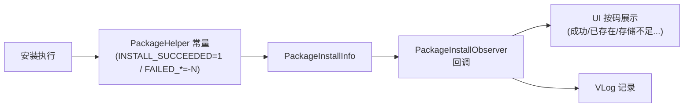

# PackageHelper · 安装结果码

::: tip 源码路径
[`src/main/java/com/lody/virtual/server/pm/installer/PackageHelper.java`](https://github.com/android-security-engineer/VirtualXposed-skills/blob/vxp/VirtualApp/lib/src/main/java/com/lody/virtual/server/pm/installer/PackageHelper.java)
:::

`PackageHelper` 集中定义 `PackageInstaller` 安装过程的结果码常量，对应 AOSP `PackageManager` 的 `INSTALL_*` 系列。各回调、UI、日志统一引用这些常量，避免魔数。

## 常量（节选）

| 常量 | 值 | 含义 |
| --- | --- | --- |
| `INSTALL_SUCCEEDED` | `1` | 成功 |
| `INSTALL_FAILED_ALREADY_EXISTS` | `-1` | 已存在 |
| `INSTALL_FAILED_INVALID_APK` | `-2` | APK 无效 |
| `INSTALL_FAILED_INVALID_URI` | `-3` | URI 无效 |
| `INSTALL_FAILED_INSUFFICIENT_STORAGE` | `-4` | 存储不足 |
| `INSTALL_FAILED_DUPLICATE_PACKAGE` | `-5` | 重复包 |
| `INSTALL_FAILED_NO_SHARED_USER` | `-6` | 无共享用户 |
| `INSTALL_FAILED_UPDATE_INCOMPATIBLE` | `-7` | 升级不兼容 |
| `INSTALL_FAILED_SHARED_USER_INCOMPATIBLE` | `-8` | 共享用户不兼容 |
| `INSTALL_FAILED_MISSING_SHARED_LIBRARY` | `-9` | 缺共享库 |
| `INSTALL_FAILED_DEXOPT` | `-11` | dex 优化失败 |
| `INSTALL_FAILED_OLDER_SDK` | `-12` | SDK 版本过低 |
| `INSTALL_FAILED_CONFLICTING_PROVIDER` | `-13` | Provider 冲突 |
| `INSTALL_FAILED_NEWER_SDK` | `-14` | SDK 版本过高 |

完整列表见源码，覆盖 AOSP 全部 `INSTALL_*` 码。

## 结果码流转

集中定义结果码避免魔数散落，回调与 UI 统一引用。

## 关联

- [`PackageInstallObserver`](./package-install-observer)：回调里带回这些码。
- [`PackageInstallerSession`](./package-installer-session)：内嵌部分码。
- [虚拟包安装器总览](./pm-installer)。
