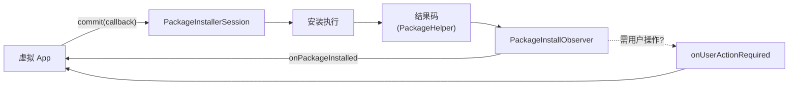

# PackageInstallObserver · 安装结果回调

::: tip 源码路径
[`src/main/java/com/lody/virtual/server/pm/installer/PackageInstallObserver.java`](https://github.com/android-security-engineer/VirtualXposed-skills/blob/vxp/VirtualApp/lib/src/main/java/com/lody/virtual/server/pm/installer/PackageInstallObserver.java)
:::

`PackageInstallObserver` 把一次安装的结果回调封装成 binder，供 `PackageInstallerSession.commit` 异步通知安装方（虚拟 App）。

## 回调方法

| 方法 | 作用 |
| --- | --- |
| `onPackageInstalled(basePackageName, returnCode, msg, extras)` | 安装完成回调，带结果码 |
| `onUserActionRequired(Intent intent)` | 需要用户操作时回调（如确认安装） |
| `getBinder()` | 取 `IPackageInstallObserver2` binder 句柄 |

## 机制

虚拟 App 调 `PackageInstaller.Session.commit(intentSender)` 时传一个回调，session 在安装结束后调用 `onPackageInstalled`，把 [`PackageHelper`](./package-helper) 定义的结果码传回，App 端据此更新 UI 或重试。

## 异步结果回调

回调封装成 `IPackageInstallObserver2` binder 跨进程回传，结果码统一来自 `PackageHelper`。

## 关联

- [`PackageInstallerSession`](./package-installer-session)：commit 调用方。
- [`PackageHelper`](./package-helper)：结果码定义。
- [虚拟包安装器总览](./pm-installer)。
