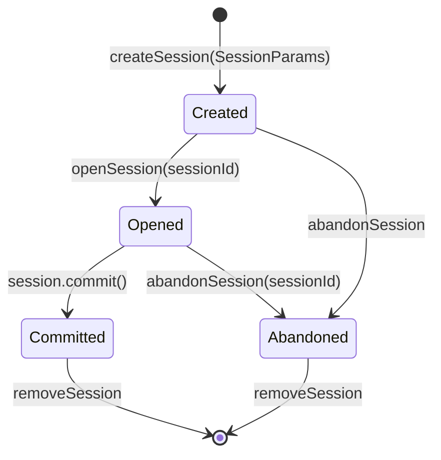

# VPackageInstallerService · 虚拟安装服务

::: tip 源码路径
[`src/main/java/com/lody/virtual/server/pm/installer/VPackageInstallerService.java`](https://github.com/android-security-engineer/VirtualXposed-skills/blob/vxp/VirtualApp/lib/src/main/java/com/lody/virtual/server/pm/installer/VPackageInstallerService.java)
:::

`VPackageInstallerService extends IPackageInstaller.Stub` 是虚拟 PackageInstaller 的服务主类，管理安装 session 的创建、查询、销毁。单例，由 [`VPackageManagerService`](./pm) 持有。

## API

| 方法 | 作用 |
| --- | --- |
| `get()` | 取单例 |
| `createSession(SessionParams, installerPackageName, userId)` | 创建一个安装 session，返回 sessionId |
| `updateSessionAppIcon(sessionId, Bitmap)` | 更新 session 的安装图标 |
| `openSession(sessionId)` | 打开 session 拿到 `IPackageInstallerSession` |
| `getSessionInfo(sessionId)` / `getAllSessions(...)` | 查询 session 信息 |
| `abandonSession(sessionId)` | 放弃某个 session |
| `removeSession(sessionId)` | 移除 session 记录 |

## session 管理

内部用 Map 维护 `sessionId → PackageInstallerSession`。每个 session 绑定一个虚拟用户和安装方包名，互不干扰。session 创建后未 commit 前可被查询进度、放弃。

## session 生命周期管理

`get()` 单例由 `VPackageManagerService` 在启动时构造，session Map 在内存中维护，进程退出即清空。

## 与真实 PackageInstaller 的对应

本服务对外暴露的 `IPackageInstaller` 接口与 AOSP `PackageInstallerService` 一致，让虚拟 App 的 `PackageInstaller` 调用无感知地落到虚拟实现上（由 [pm 代理](../proxies/pm) 把 `getPackageInstaller` 重定向）。

## 关联

- [`PackageInstallerSession`](./package-installer-session)：它创建的会话对象。
- [`SessionParams` / `SessionInfo`](./installer-data)：参数与信息载体。
- [虚拟包安装器总览](./pm-installer)。
