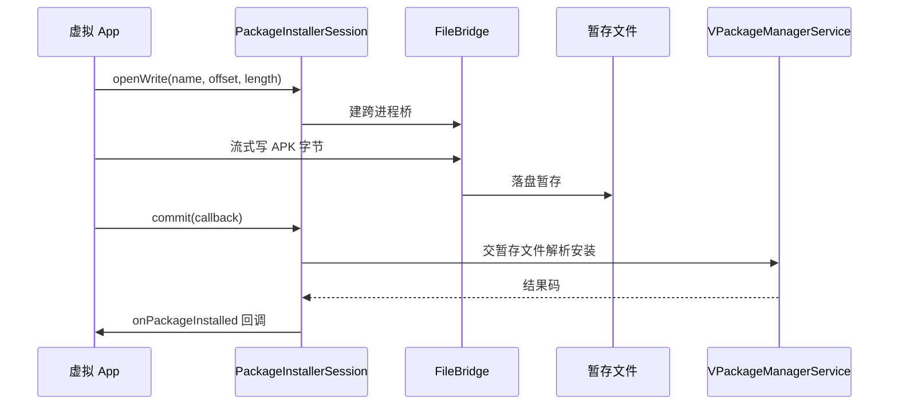

# PackageInstallerSession · 安装会话

::: tip 源码路径
[`src/main/java/com/lody/virtual/server/pm/installer/PackageInstallerSession.java`](https://github.com/android-security-engineer/VirtualXposed-skills/blob/vxp/VirtualApp/lib/src/main/java/com/lody/virtual/server/pm/installer/PackageInstallerSession.java)
:::

`PackageInstallerSession extends IPackageInstallerSession.Stub` 表示一次分阶段安装会话。虚拟 App 通过它写入 APK 数据流，commit 后触发真实安装。

## 核心方法

| 方法 | 作用 |
| --- | --- |
| `openWrite(name, offset, length)` | 打开一个写入句柄，App 往里写 APK 分片数据 |
| `close(handle)` | 关闭写入句柄 |
| `commit(callback)` | 提交会话，触发安装并回调结果 |
| `setStagingProgress(progress)` | 报告暂存进度 |
| `abandon()` | 放弃会话 |

## 安装结果码

内嵌 AOSP 一致的结果常量：

| 常量 | 含义 |
| --- | --- |
| `INSTALL_SUCCEEDED` (`1`) | 安装成功 |
| `INSTALL_FAILED_INTERNAL_ERROR` (`-110`) | 内部错误 |
| `INSTALL_FAILED_ABORTED` (`-115`) | 中止 |

## 写入机制

`openWrite` 返回的句柄通过 [`FileBridge`](./file-bridge) 跨进程传 APK 数据——App 端写入流，session 端读到临时暂存文件，commit 时把暂存文件交给 [`VPackageManagerService`](./pm) 解析安装。

## 会话写入与提交流

## 关联

- [`VPackageInstallerService`](./package-installer-service)：创建方。
- [`FileBridge`](./file-bridge)：跨进程文件传输。
- [`PackageInstallObserver`](./package-install-observer)：commit 回调。
- [虚拟包安装器总览](./pm-installer)。
