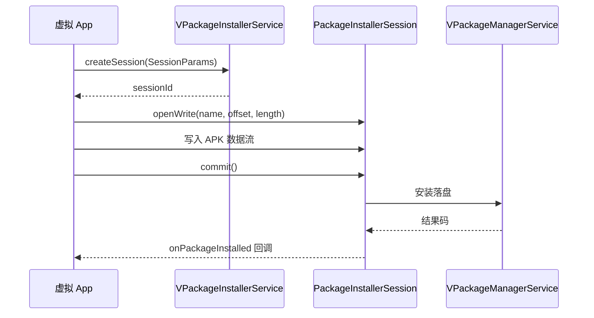

# server/pm/installer · 虚拟包安装器

::: tip 源码路径
[`src/main/java/com/lody/virtual/server/pm/installer/`](https://github.com/android-security-engineer/VirtualXposed-skills/tree/vxp/VirtualApp/lib/src/main/java/com/lody/virtual/server/pm/installer)
:::

虚拟版的 `PackageInstaller`，对应 AOSP 的 `packageinstaller` 子系统。让虚拟 App 能用标准 `PackageInstaller` API 分阶段、可观察地安装 APK（带进度、确认、回滚），共 **8 个文件**。配合 [`VPackageManagerService`](./pm) 与 [包管理](../../features/package-manager)。

## 为什么需要它

`PackageInstaller` 是 Android 5.0+ 引入的分阶段安装 API：创建 session → 写入 APK 流 → commit。虚拟 App 调这套 API 时，真实系统的 PackageInstaller 不认虚拟包，必须由 VirtualXposed 自己实现一套等价服务，把安装流引导到虚拟 PMS。

## 文件组成

| 文件 | 职责 |
| --- | --- |
| [`VPackageInstallerService`](./package-installer-service) | 服务主类，`IPackageInstaller.Stub`，管理 session 生命周期 |
| [`PackageInstallerSession`](./package-installer-session) | 单个安装会话，`IPackageInstallerSession.Stub`，接收 APK 流写入 |
| `PackageHelper` | 安装结果码常量（`INSTALL_SUCCEEDED` 等） |
| `PackageInstallObserver` | 安装结果回调包装（`IPackageInstallObserver2`） |
| `PackageInstallInfo` | 安装信息载体 |
| `SessionInfo` | session 元信息（`Parcelable`）：id、安装方包名、APK 路径 |
| `SessionParams` | session 参数（`Parcelable`）：安装模式、选项 |
| `FileBridge` | 跨进程文件传输桥（写 APK 流用） |

## 安装流程

## 关联

- [`VPackageManagerService`](./pm)：最终安装执行方。
- [包管理](../../features/package-manager)。
- [`VAppManagerService`(./pm)：同步安装路径。
