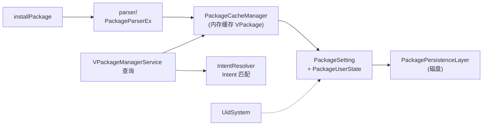

# server/pm · 虚拟包管理服务

::: tip 源码路径
[`src/main/java/com/lody/virtual/server/pm/`](https://github.com/android-security-engineer/VirtualXposed-skills/tree/vxp/VirtualApp/lib/src/main/java/com/lody/virtual/server/pm)
:::

虚拟 PMS 的完整实现，分装/卸、查询、多用户三块。共 **3 个服务 + 解析器 + 安装器 + 多个支撑类**。

## 文件组成

### 服务类

| 文件 | 职责 |
| --- | --- |
| `VAppManagerService.java` | 安装/卸载/多用户管理、UID 分配、持久化 |
| `VPackageManagerService.java` | 查询：包/组件信息、Intent 路由、权限检查 |
| `VUserManagerService.java` | 虚拟多用户管理 |

### 支撑类

| 文件 | 职责 |
| --- | --- |
| `PackageCacheManager.java` | 内存缓存所有 `VPackage` |
| `PackageSetting.java` | 一个包的安装设置（路径、UID、用户状态） |
| `PackageUserState.java` | 单个用户下某包的启用/禁用状态 |
| `PackagePersistenceLayer.java` | 包列表持久化 |
| `IntentResolver.java` | `<intent-filter>` 匹配（参照 AOSP） |
| `ProviderIntentResolver.java` | Provider 专用 Intent 匹配 |
| `FastImmutableArraySet.java` | Intent 匹配用的快速集合 |
| `PrivilegeAppOptimizer.java` | 特权 App 优化 |

### 子目录

| 子目录 | 职责 |
| --- | --- |
| `parser/` | `PackageParserEx`——APK 解析（复用系统 `PackageParser`） |
| `installer/` | 安装器实现 |

## 核心机制

详见 [包管理 (PMS)](../../features/package-manager)。要点：

- **安装流程**：`PackageParserEx.parsePackage` → 复制到 `VEnvironment` 私有目录 → 抽 native 库 → `UidSystem` 分配虚拟 UID → `PackageCacheManager.put` → 持久化
- **查询**：`VPackageManagerService` 实现完整 PMS 查询接口，`IntentResolver` 做 `<intent-filter>` 匹配
- **隔离**：系统 PMS 完全不知道虚拟 App 存在，UID 是虚拟空间自编的

