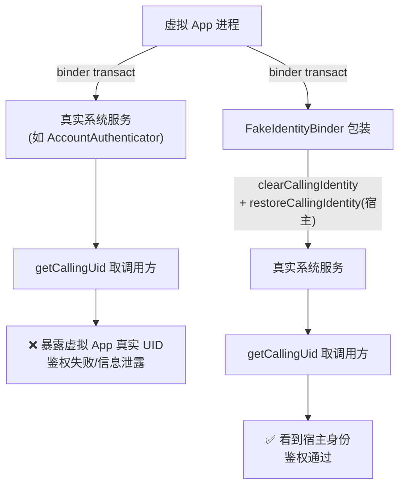
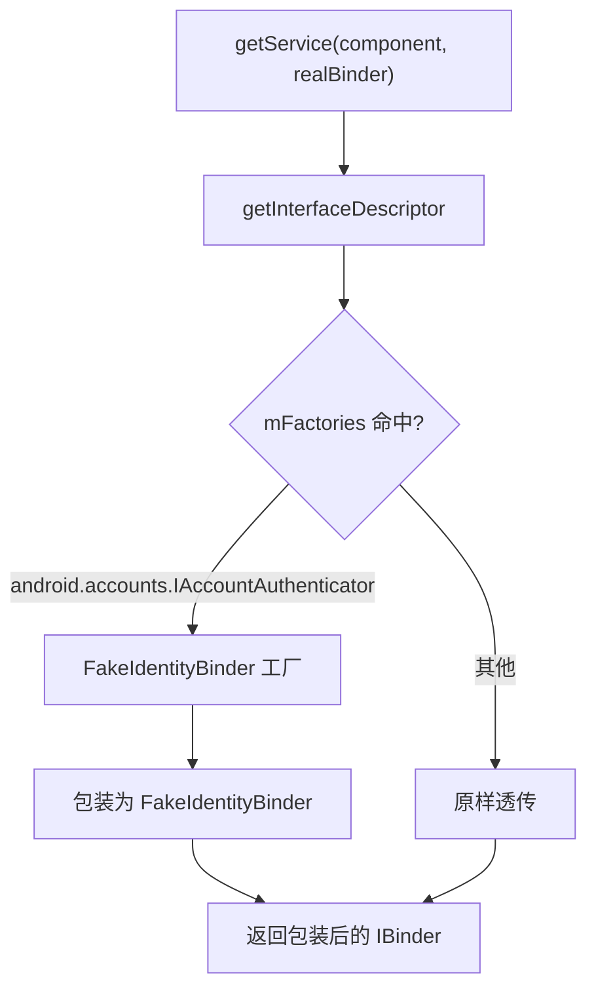
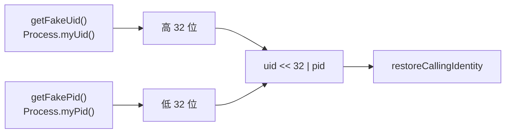

# server/secondary · 次级服务与 Binder 身份伪造

::: tip 源码路径
[`src/main/java/com/lody/virtual/server/secondary/`](https://github.com/android-security-engineer/VirtualXposed-skills/tree/vxp/VirtualApp/lib/src/main/java/com/lody/virtual/server/secondary)
:::

次级服务模块，2 个文件。解决虚拟 App 调用真实系统服务时的 Binder 调用方身份（UID/PID）问题——`Binder.getCallingUid()` 在虚拟环境下会暴露真实调用方，本模块把它伪装成宿主进程身份。

## 文件组成

| 文件 | 职责 |
| --- | --- |
| [`BinderDelegateService.java`](https://github.com/android-security-engineer/VirtualXposed-skills/blob/vxp/VirtualApp/lib/src/main/java/com/lody/virtual/server/secondary/BinderDelegateService.java) | 服务代理分发器，按 interfaceDescriptor 查工厂包装真实 Binder |
| [`FakeIdentityBinder.java`](https://github.com/android-security-engineer/VirtualXposed-skills/blob/vxp/VirtualApp/lib/src/main/java/com/lody/virtual/server/secondary/FakeIdentityBinder.java) | 伪造调用方 UID/PID 的 Binder 包装器 |

## FakeIdentityBinder 工作机制

真实方法（从源码提取）：

| 方法 | 作用 |
| --- | --- |
| `onTransact(code, data, reply, flags)` | 拦截每个 transact：先 `clearCallingIdentity`，再 `restoreCallingIdentity(getFakeIdentity())`，转发给 mBase |
| `getFakeIdentity()` | `getFakeUid() << 32 | getFakePid()`（高 32 位 UID，低 32 位 PID） |
| `getFakeUid()` | 返回 `Process.myUid()`（宿主 UID） |
| `getFakePid()` | 返回 `Process.myPid()`（宿主 PID） |
| `queryLocalInterface` / `attachInterface` / `getInterfaceDescriptor` | 透传给 mBase，保持接口一致 |

## 为什么需要伪造身份

`Binder.clearCallingIdentity()` 清掉原始调用方，`restoreCallingIdentity(getFakeIdentity())` 把宿主进程的 UID/PID（`Process.myUid()`/`Process.myPid()`）写入——后续 `getCallingUid`/`getCallingPid` 看到的是宿主而非虚拟 App。

## BinderDelegateService 分发

`mFactories` 是 `Map<String, ProxyBinderFactory>`，目前只注册了 `IAccountAuthenticator`。其他服务原样透传——只有需要伪造身份的服务才包装。

## 身份编码细节

`getFakeIdentity()` 把 UID 和 PID 编码进一个 long：

这与 AOSP `IPCThreadState` 的 `calling_uid << 32 | calling_pid` 编码一致（见源码注释引用的 `IPCThreadState.cpp#356`），保证 `Binder.getCallingUid()`/`getCallingPid()` 能正确拆解。

详见 [IPC 桥](../../features/ipc-bridge)。
