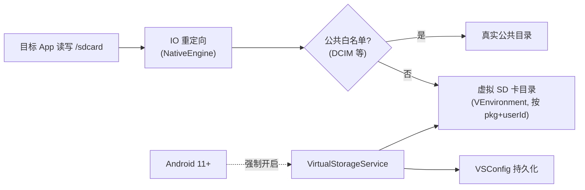

# server/vs · 虚拟存储服务

::: tip 源码路径
[`src/main/java/com/lody/virtual/server/vs/`](https://github.com/android-security-engineer/VirtualXposed-skills/tree/vxp/VirtualApp/lib/src/main/java/com/lody/virtual/server/vs)
:::

`VirtualStorageService` 管理虚拟 SD 卡（外部存储隔离）。共 3 个文件。

## 文件组成

| 文件 | 职责 |
| --- | --- |
| `VirtualStorageService.java` | 服务主类，虚拟存储启用/查询 |
| `VSConfig.java` | 虚拟存储配置 |
| `VSPersistenceLayer.java` | 配置持久化 |

## 核心机制

- 每个 `(包名, userId)` 可有独立的虚拟 SD 卡目录（`VEnvironment.getVirtualStorageDir`）
- Android 11+ 强制开启（配合 Scoped Storage）
- 配合 [IO 重定向](../../features/io-redirect)：客户端把 `/sdcard` 重定向到虚拟 SD 卡，公共目录（DCIM 等）白名单不重定向
- 配置持久化，重启恢复

## 虚拟 SD 卡隔离

每 `(包名, userId)` 独立虚拟 SD 卡，公共目录白名单放行，其余重定向到隔离目录。
