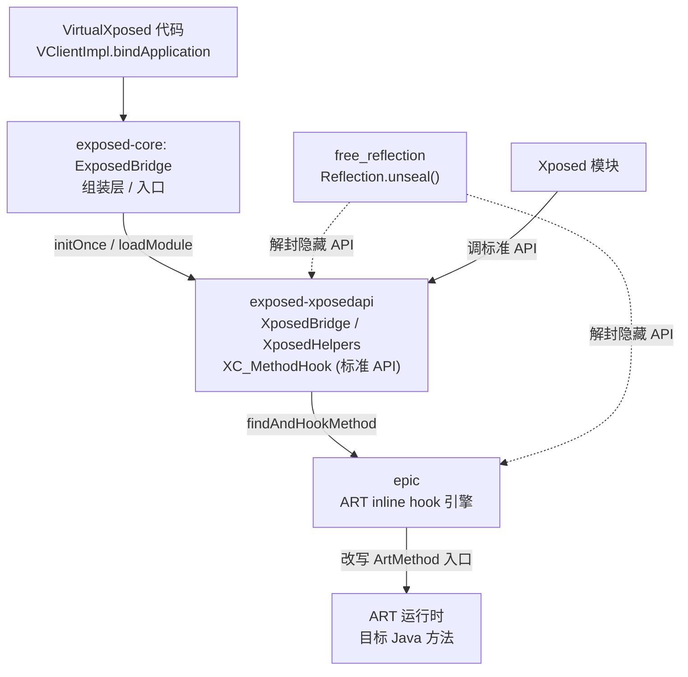
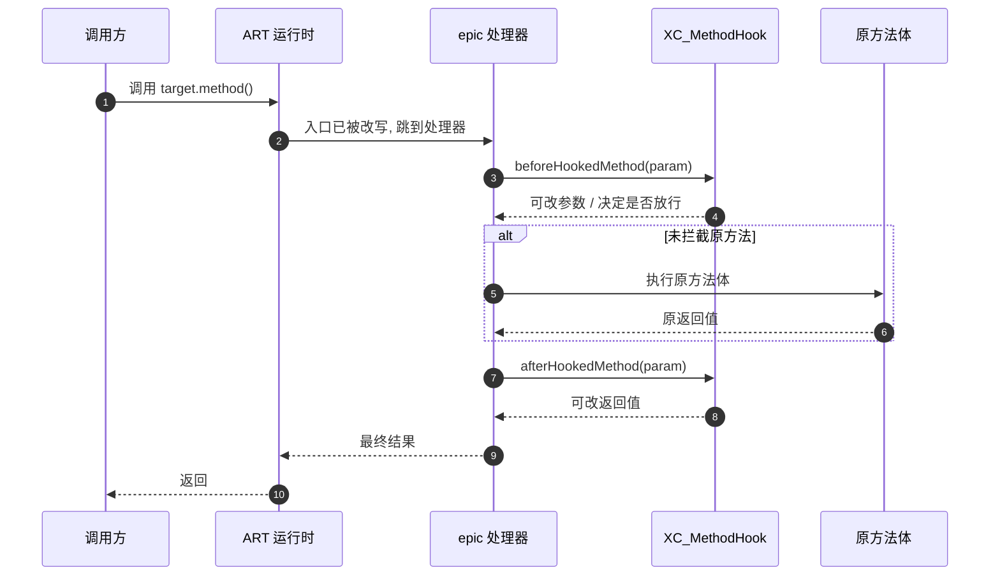

# epic 与 ExposedBridge

这一篇讲 VirtualXposed 的 Xposed 能力具体由哪些库提供，以及它们各自的角色。epic 和 ExposedBridge 都是 weishu（Tiann）的项目，VirtualXposed 通过 Maven 依赖引入。

## 三个依赖

`lib/build.gradle`：

```groovy
api("me.weishu.exposed:exposed-core:0.8.1") {
    exclude group: 'me.weishu', module: 'free_reflection'
    exclude group: 'me.weishu', module: 'epic'
    exclude group: 'me.weishu.exposed', module: 'exposed-xposedapi'
}
implementation "me.weishu:free_reflection:3.0.1"
implementation "me.weishu:epic:0.11.1"
implementation "me.weishu.exposed:exposed-xposedapi:0.4.6"
```

注意 `exposed-core` 排除了另外三个，再分别 `implementation` 引入——这样能精确控制版本，避免传递依赖的版本冲突。四个库的分工：



模块只和标准 Xposed API 打交道，底层 epic 和反射解封对模块透明。

| 库 | 角色 |
| --- | --- |
| `me.weishu:epic` | **ART 方法 Hook 引擎**。在 ART 运行时层面做 inline hook，改写方法入口。这是底层能力。 |
| `me.weishu:free_reflection` | **绕过 Android 9+ 反射限制**。让 epic 和 mirror 能访问隐藏 API。 |
| `me.weishu.exposed:exposed-xposedapi` | **Xposed API 实现**。提供 `XposedBridge`、`XposedHelpers`、`XC_MethodHook`、`XC_LoadPackage` 等标准 Xposed 接口类，底层调 epic。 |
| `me.weishu.exposed:exposed-core` | **桥接层 `ExposedBridge`**。把上面三样组装起来：初始化 epic、加载模块、把模块的 Hook 调用转发到 epic。 |

## epic：ART inline hook

epic 是整个方案的技术核心。它做的事：

- 在 ART 运行时里找到目标方法的入口地址（ART 方法是 `ArtMethod` 结构，有 `entry_point_from_quick_compiled_code` 等字段）。
- 用 inline hook 把入口指令改写，跳到 epic 的 hook 处理器。
- hook 处理器按注册的 `XC_MethodHook` 调 `beforeHookedMethod` / 替换 / `afterHookedMethod`，再返回原方法或改写结果。

关键点：**这一切都在 App 进程内完成，不需要 Root，不需要改 Zygote**。epic 用 `fake_dlfcn` 之类的手段在进程内找 ART 内部符号（`libart.so` 的导出/内部函数），然后 inline hook。这正是“免 Root”成立的基础。

epic 的局限：

- 只 hook **Java 方法**（ART 管理的），不 hook native 函数（那是 VirtualXposed 自己 `libva++.so` 的 `VMPatch`/`IOUniformer` 干的）。
- 对 ART 版本敏感——每个 Android 大版本 ART 内部结构都变，epic 要持续适配。这也是 VirtualXposed 支持范围停在 Android 10 的主因之一。

## ExposedBridge：组装层

`ExposedBridge`（`exposed-core` 里，`me.weishu.exposed.ExposedBridge`）是 VirtualXposed 直接调用的入口。它的工作：

1. **`initOnce(context, appInfo, classLoader)`**：
   - 初始化 epic 的 hook 引擎（注册 ART 符号解析、准备 hook 表）。
   - 初始化 `exposed-xposedapi` 的 `XposedBridge`（让它能转发到 epic）。
   - 建立“模块 → 目标 App”的加载上下文。

2. **`loadModule(apkPath, odexDir, libPath, appInfo, classLoader)`**：
   - 用 DexClassLoader 加载模块（见[模块加载流程](./module-loading.md)）。
   - 读 `xposed_init`，实例化入口类。
   - 调 `handleLoadPackage`，传入当前目标 App 的 `LoadPackageParam`。
   - 模块里调的 `XposedBridge.findAndHookMethod` 最终落到 epic。

3. **Hook 执行**：
   - 目标方法被调用时，ART 跳到 epic 的处理器。
   - epic 查 Hook 表，调对应 `XC_MethodHook.beforeHookedMethod`。
   - 决定是否继续原方法、是否替换参数/返回值。
   - 调 `afterHookedMethod`。



`before` 能改参数或直接短路返回，`after` 能改返回值——和经典 Xposed 语义一致。

## ExposedBridge 还做了什么

除了 hook，`exposed-core` 还负责一些周边能力（`BaseVirtualInitializer` 里用到的）：

```java
import me.weishu.exposed.LogcatService;
// BaseVirtualInitializer.onVirtualProcess()
LogcatService.start(application, VEnvironment.getDataUserPackageDirectory(0, XPOSED_INSTALLER_PACKAGE));
```

`LogcatService` 是给 Xposed Installer 提供日志查看能力的——Xposed 模块的日志输出需要被捕获展示，VirtualXposed 在每个虚拟进程启动 `LogcatService` 收集 logcat。

`VirtualCore.TAICHI_PACKAGE = "me.weishu.exp"` 这个常量暗示了对 TaiChi（另一个 weishu 的免 Root Xposed 项目）的兼容考虑。

## free_reflection：反射解封

`VirtualCore.startup()` 第一行：

```java
Reflection.unseal(context);
```

Android 9（API 28）起，系统限制反射访问 `@hide` 和灰名单 API。epic 要 hook ART 内部方法、mirror 要访问 `ActivityThread.mH` 等隐藏字段，都被这层限制挡住。

`free_reflection` 通过 JNI 修改 ART 的反射检查（早期是改 `setHiddenApiExemptions`，更早版本是 hook `getDeclaredMethod` 等的检查逻辑），让所有反射调用畅通。没有它，整个 VirtualXposed 在 Android 9+ 直接瘫。

## 和 VirtualApp native 层的关系

VirtualXposed 的 native 能力分两摊：

| 能力 | 提供方 | 场景 |
| --- | --- | --- |
| ART Java 方法 hook | epic | Xposed 模块的 hook |
| libc 文件函数 hook | `libva++.so` (IOUniformer) | IO 重定向 |
| Java native 方法 hook | `libva++.so` (VMPatch) | openDex/Camera/Audio |
| inline hook 基础设施 | `libva++.so` (Substrate/And64InlineHook) | 供 IOUniformer/VMPatch 用 |

epic 自带自己的 inline hook 实现（针对 ART），和 `libva++.so` 的 Substrate/And64InlineHook 是**两套独立的 hook 基础设施**，各 hook 各的目标。这是因为 epic 要 hook 的是 ART 方法（有 ArtMethod 结构），而 `libva++.so` hook 的是 libc/Java-native（普通函数指针），技术细节不同。

## 版本与兼容

依赖版本（`lib/build.gradle`）：

- epic `0.11.1` —— 支持 Android 5.0~10.0 的 ART。
- exposed-core `0.8.1` / exposed-xposedapi `0.4.6` —— 对应版本的桥接和 API。
- free_reflection `3.0.1` —— 支持 Android 9/10 的反射解封。

这套版本组合决定了 VirtualXposed 的 Android 支持上限（10.0）。更高版本需要更新 epic/exposed 的版本，但仓库当前锁在这套。

## 小结

- **epic** 提供 ART inline hook（免 Root 的方法 hook 底层能力）。
- **exposed-xposedapi** 提供标准 Xposed API（`XposedBridge`/`XC_MethodHook`），让模块零改动接入。
- **ExposedBridge**（exposed-core）组装两者 + 模块加载，是 VirtualXposed 直接调用的入口。
- **free_reflection** 解封 Android 9+ 反射限制，是 epic 和 mirror 的前置依赖。
- VirtualXposed 的 native 能力分摊在 epic（ART hook）和 `libva++.so`（libc/native 方法 hook）两套独立设施上。

最后一篇看为什么这套方案不支持资源 Hook——[资源 Hook 限制](./resource-hook-limit.md)。
