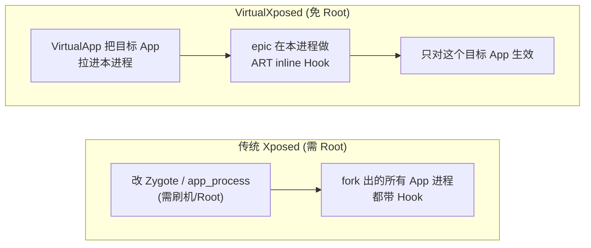
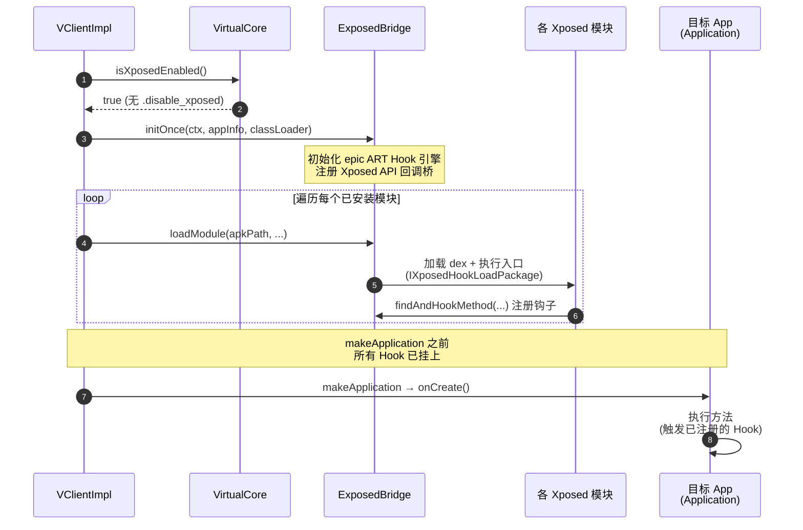

# 免 Root Hook 原理

这一篇讲 VirtualXposed 怎么在不 Root 的前提下，实现 Xposed 模块对目标 App 的方法 Hook。

## 传统 Xposed 为什么需要 Root

Xposed 的 Hook 发生在 **ART 运行时**层面——它改写 ART 内部的方法分发表，让目标方法的执行跳到自己的回调。要这么做，Xposed 必须：

1. 在 `app_process`（Zygote）启动时注入 Xposed 框架，因为所有 App 进程都 fork 自 Zygote，注入一次影响全局。
2. 替换 `app_process` 二进制或用 Magisk 在系统层挂载——这都需要 Root/刷机。
3. 模块在 Zygote 阶段就被加载，等 App fork 出来后自然带着 Hook。

核心障碍不是“Hook 技术本身需要 Root”，而是“**要让 Hook 在系统全局生效，就必须改系统**”。

## VirtualXposed 的转换：全局 → 进程内

epic 已经证明：**在任意 App 进程里，可以不 Root 就做 ART 方法 hook**（靠 inline hook 改 ART 方法入口，绕过对 Zygote 的依赖）。

那为什么以前没人这么做？因为单进程 Hook 没用——你 Hook 的是“你自己这个进程”，对别的 App 没影响，而你想 Hook 的目标 App 又不在你进程里。

VirtualXposed 的关键转换是：**用 VirtualApp 把目标 App 拉进我的进程里跑**。一旦目标 App 在我的进程里执行，那我在这个进程里做的 ART Hook 就对它生效了。



把“全局生效”问题降级成“单进程生效”问题，而单进程 Hook 恰好 epic 能免 Root 做到。

## 两个角色的分工

- **VirtualApp**：负责“把目标 App 拉进我的进程”——虚拟化系统服务、绑定 Application、IO 重定向，让目标 App 以为自己在真系统，实际跑在 VirtualXposed 进程里。这部分前面[功能详解](../features/app-virtualization.md)讲过。
- **epic + ExposedBridge**：负责“在本进程对目标 App 的方法做 Hook”——加载 Xposed 模块、在 ART 层改写方法入口、把 Xposed API 暴露给模块。这一篇及后续几篇讲这个。

## 进程内的 Hook 流程

目标 App 进程起来后，`VClientImpl.bindApplicationNoCheck` 在绑定 Application 的过程中做 Xposed 初始化：

```java
boolean enableXposed = VirtualCore.get().isXposedEnabled();
if (enableXposed) {
    VLog.i(TAG, "Xposed is enabled.");
    ClassLoader originClassLoader = context.getClassLoader();
    // 1. 初始化 epic + Xposed API
    ExposedBridge.initOnce(context, data.appInfo, originClassLoader);
    // 2. 加载所有已安装的 Xposed 模块
    List<InstalledAppInfo> modules = VirtualCore.get().getInstalledApps(0);
    for (InstalledAppInfo module : modules) {
        ExposedBridge.loadModule(module.apkPath, module.getOdexFile().getParent(),
                module.libPath, data.appInfo, originClassLoader);
    }
}
```

三步：

1. **`isXposedEnabled()`**：检查 `.disable_xposed` 标记文件是否存在（用户可在设置里关 Xposed）。
2. **`ExposedBridge.initOnce`**：初始化 epic 的 ART Hook 引擎，注册 Xposed API 的回调桥。
3. **`loadModule`**：遍历虚拟环境里已安装的 App，把每个当作潜在 Xposed 模块加载——加载其 dex，执行模块的入口（`IXposedHookLoadPackage`/`xposed_init`），让模块调用 `XposedBridge.findAndHookMethod` 注册自己的钩子。

## isXposedEnabled：开关

```java
public boolean isXposedEnabled() {
    return !getContext().getFileStreamPath(".disable_xposed").exists();
}
```

一个简单的文件开关。用户在 VirtualXposed 设置里关 Xposed，就建这个文件；`bindApplication` 时检查，关了就跳过整个 Xposed 初始化——目标 App 照常跑，但不加载任何模块。

## 为什么模块和目标 App 必须都在 VirtualXposed 里

回到[快速使用](../guide/quick-start.md)强调的规则：目标 App 和模块**必须都装在 VirtualXposed 内部**。原因现在清楚了：

- Hook 是**进程内**的。模块的代码要 Hook 目标 App 的方法，两者必须在**同一个进程**里。
- VirtualApp 只把“装在 VirtualXposed 里的 App”拉进虚拟进程。模块装在系统里，它就不在虚拟进程里，自然无法 Hook虚拟进程里的目标 App。
- 反之目标 App 装系统里，它不在虚拟进程里，VirtualXposed 的 Hook 够不着。

所以必须两者都在虚拟环境里，VirtualApp 才会把它们一起拉进同一个虚拟进程（或可互通的进程），epic 的 Hook 才能搭上。



Hook 在 `makeApplication` 之前完成注册，是模块能 Hook 到 `Application.onCreate` 等早期方法的关键。

## Hook 生效的时机

`bindApplicationNoCheck` 在 `makeApplication` **之前**完成 Xposed 初始化和模块加载。这意味着：

- 模块注册的 Hook 在目标 App 的 `Application.onCreate()` 之前就挂上了。
- 目标 App 的任何方法（包括 `Application.onCreate`、`attachBaseContext` 之后的逻辑）一执行就会被 Hook。

模块加载顺序在 `makeApplication` 之前是关键——这样模块能 Hook 到 Application 早期的方法（很多 Xposed 模块就是要在 `onCreate` 里改东西）。

## 小结

- 传统 Xposed 需要 Root 是因为“全局生效”要求改 Zygote。
- VirtualXposed 用 VirtualApp 把目标 App 拉进自己进程，把全局问题降级为单进程问题。
- epic 能免 Root 做单进程 ART Hook，两者结合实现免 Root Xposed。
- `bindApplication` 时 `initOnce` + 遍历 `loadModule`，在 `makeApplication` 前完成 Hook 注册。
- 模块和目标 App 必须同进程，所以都必须装在 VirtualXposed 里。

接下来看[模块加载流程](./module-loading.md)的细节，然后[epic 与 ExposedBridge](./epic-exposed.md) 的 ART Hook 原理。
