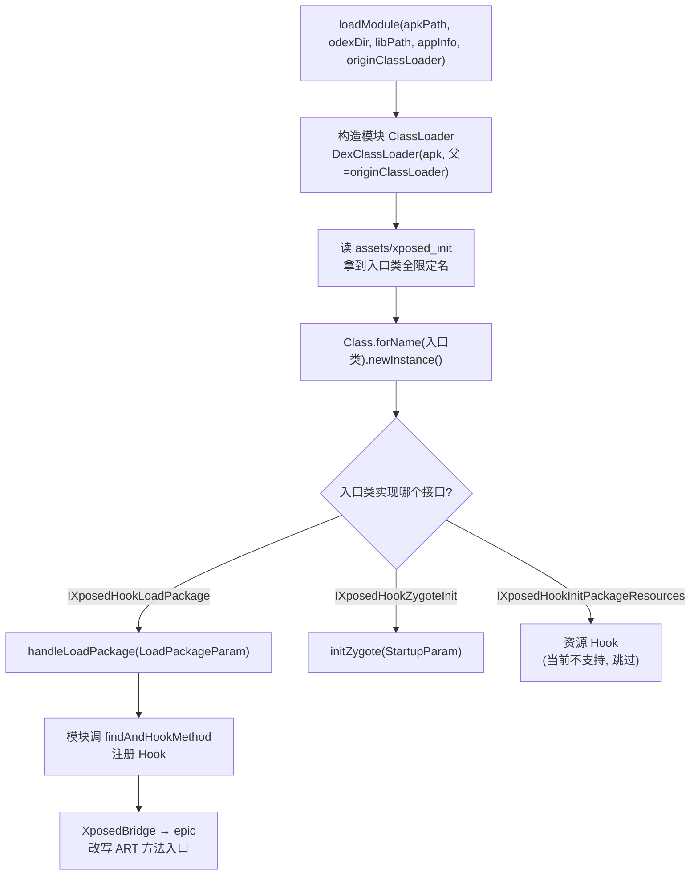

# 模块加载流程

这一篇钻进 `ExposedBridge.loadModule` 的细节，看一个 Xposed 模块的 APK 是怎么被加载、初始化并注册钩子的。

## Xposed 模块的结构

一个 Xposed 模块就是一个普通 APK，特殊在两点：

1. **`xposed_init`**：`AndroidManifest.xml` 里有个 meta-data `xposedmodule=true`，且 `assets/xposed_init` 文件写明了入口类名（实现 `IXposedHookLoadPackage` 等接口的类）。
2. **依赖 Xposed API**：模块编译时引用了 `XposedBridge`/`XposedHelpers` 等 API 类，运行时这些类由环境提供（不是模块自带）。

VirtualXposed 要做的就是：加载模块 APK → 找到入口类 → 实例化 → 调它的 `handleLoadPackage` → 在这个回调里模块用 `XposedBridge.findAndHookMethod` 注册钩子。



模块的 ClassLoader 父链指向目标 App 的 `originClassLoader`，是它能 `findClass` 到目标类的前提。

## loadModule 的参数

```java
ExposedBridge.loadModule(
    module.apkPath,              // 模块 APK 路径
    module.getOdexFile().getParent(),  // odex 输出目录
    module.libPath,              // native 库目录
    data.appInfo,                // 当前目标 App 的 ApplicationInfo
    originClassLoader           // 宿主/目标 App 的 ClassLoader
);
```

这些参数来自 `VAppManagerService` 维护的 `InstalledAppInfo`——模块作为“已安装的虚拟 App”被遍历到。注意 `data.appInfo` 是**当前要启动的目标 App**的信息，模块需要它来判断“我要不要 Hook 这个包”。

## 加载流程（基于 ExposedBridge 的约定）

`ExposedBridge`（来自 `me.weishu.exposed:exposed-core`）的 `loadModule` 大致做这些事（库内部实现，仓库以 Maven 依赖引入，不在源码里）：

1. **构造模块 ClassLoader**：用 `DexClassLoader`（或等价机制）加载模块 APK 的 dex，父 ClassLoader 是 `originClassLoader`——这样模块能访问到目标 App 的类（用于 Hook 目标方法）和 Xposed API 类（由 ExposedBridge 提供）。
2. **读 `xposed_init`**：从模块 APK 的 `assets/xposed_init` 读入口类全限定名。
3. **实例化入口类**：`Class.forName(入口类, true, 模块ClassLoader).newInstance()`。
4. **分发回调**：根据入口类实现的接口调对应方法：
   - `IXposedHookLoadPackage.handleLoadPackage(LoadPackageParam)` —— 最常用，每个 App 包加载时回调。
   - `IXposedHookZygoteInit.initZygote(StartupParam)` —— 进程级初始化。
   - `IXposedHookInitPackageResources`（资源 Hook，当前不支持，见[资源 Hook 限制](./resource-hook-limit.md)）。
5. **`LoadPackageParam`** 里带 `packageName`、`appInfo`、`classLoader` 等，模块据此判断并注册 Hook。

## 模块如何注册 Hook

模块在 `handleLoadPackage` 里典型写法：

```java
public void handleLoadPackage(XC_LoadPackage.LoadPackageParam lpparam) {
    if (!lpparam.packageName.equals("com.target")) return;  // 只 Hook 目标包
    XposedHelpers.findAndHookMethod(
        "com.target.MainActivity", lpparam.classLoader,
        "onCreate", Bundle.class,
        new XC_MethodHook() {
            @Override
            protected void afterHookedMethod(MethodHookParam param) {
                // 改 onCreate 后的行为
            }
        });
}
```

`XposedBridge.findAndHookMethod` / `XposedHelpers.findAndHookMethod` 最终调到 epic 的 ART Hook——把目标方法的 ART 入口改写，跳到 `XC_MethodHook` 的 `before`/`after` 回调。详见[epic 与 ExposedBridge](./epic-exposed.md)。

## 为什么遍历所有已安装 App 当模块

```java
List<InstalledAppInfo> modules = VirtualCore.get().getInstalledApps(0);
for (InstalledAppInfo module : modules) {
    ExposedBridge.loadModule(module.apkPath, ...);
}
```

注意：它遍历的是**所有已安装的虚拟 App**，不区分哪个是模块。判断“是不是模块”由 `loadModule` 内部做——读 `AndroidManifest` 的 `xposedmodule` meta-data，是模块才加载，否则跳过。

这简化了逻辑：不需要单独维护“模块列表”，凡是装进 VirtualXposed 的 App，启动时都会被尝试当作模块加载一次。普通 App 没有 `xposed_init`，自动跳过。

但这也带来一个后果：**模块必须装在 VirtualXposed 里**（装系统里的不会被遍历到），呼应了[快速使用](../guide/quick-start.md)的规则。

## 模块激活状态

传统 Xposed 在 Xposed Installer 里勾选模块来“激活”。VirtualXposed 内置了 Xposed Installer，勾选状态存在模块自己的数据里。`loadModule` 时会检查模块是否被激活——未激活的不加载。

这解释了[快速使用](../guide/quick-start.md)里的流程：装模块 → 在 Xposed Installer 勾选 → 重启 VirtualXposed → 模块在 `bindApplication` 时被加载生效。

## odex 与 native 库

`loadModule` 传了 `odexFile.getParent()` 和 `libPath`：

- **odex 目录**：模块 APK 的 dex 要优化（dex2oat）产物存放位置，VirtualApp 给每个虚拟 App 分配了 odex 文件（`VEnvironment.getOdexFile`）。
- **libPath**：模块的 native 库（`.so`）目录，由 `NativeLibraryHelperCompat` 在安装时抽取。

这俩和[包管理](../features/package-manager.md)的安装流程对接——模块作为虚拟 App 被安装时，APK 复制、lib 抽取、odex 路径都已准备好，`loadModule` 直接用。

## 与目标 App ClassLoader 的关系

`loadModule` 的 `originClassLoader` 参数是关键。模块 ClassLoader 的父是它，意味着：

- 模块代码里 `XposedHelpers.findClass("com.target.X", lpparam.classLoader)` 能找到目标 App 的类。
- 模块自己定义的类和目标 App 的类在同一个类加载体系里，Hook 能命中。

这依赖 VirtualApp 的 `bindApplication` 已先用 `createPackageContext` + `LoadedApk.makeApplication` 把目标 App 的代码加载好——模块加载时目标 App 的 ClassLoader 已就绪。

## 顺序：Hook 在 makeApplication 之前

回到 `bindApplicationNoCheck` 的顺序：

```java
// 1. Xposed 初始化 + 模块加载（注册 Hook）
ExposedBridge.initOnce(...);
for (module : modules) ExposedBridge.loadModule(...);

// 2. 之后才创建目标 App 的 Application
mInitialApplication = LoadedApk.makeApplication.call(data.info, false, null);
// 3. 调 Application.onCreate
mInstrumentation.callApplicationOnCreate(mInitialApplication);
```

Hook 在 `makeApplication` 之前注册，所以目标 App 的 `Application.onCreate`、`attachBaseContext` 等早期方法的执行就已经被 Hook 拦截。这对很多模块（要在 App 启动早期介入）是必需的。

## 小结

- `loadModule` 用 DexClassLoader 加载模块 APK，读 `xposed_init` 找入口，实例化并调 `handleLoadPackage`。
- 遍历所有已安装虚拟 App 当潜在模块，靠 `xposedmodule` meta-data 区分。
- 模块用 `XposedBridge.findAndHookMethod` 注册 Hook，底层走 epic。
- 模块 ClassLoader 父链指向目标 App ClassLoader，保证能 Hook 到目标类。
- Hook 在 `makeApplication` 前注册，覆盖目标 App 早期方法。

下一篇看 epic 到底怎么在 ART 层面改写方法入口——[epic 与 ExposedBridge](./epic-exposed.md)。
