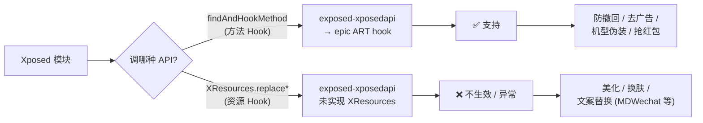

# 为何不支持资源 Hook

VirtualXposed 明确不支持资源 Hook（Resource Hook）。这一篇解释什么是资源 Hook、为什么不支持、影响哪些模块。

## 什么是资源 Hook

Xposed 的资源 Hook 通过 `XResources` API 改 App 的资源：

```java
// 典型资源 Hook（Xposed 模块写法）
XResources.setSystemWideResReplacement("com.target", "bool", "config_use_new_ui", true);

resparam.resHooks.replaceText(...);   // 替换字符串资源
resparam.resHooks.replaceDrawable(...); // 替换图片资源
resparam.resHooks.replaceLayout(...);   // 改布局
```

入口是模块实现 `IXposedHookInitPackageResources.handleInitPackageResources`，拿到 `XResources` 后注册资源替换。运行时 App 调 `getString`/`getDrawable`/`getLayout` 时，Xposed 拦截资源加载，返回替换后的值。

用途：**主题美化、UI 改造、文案替换**。典型模块如 MDWechat（把微信改成 Material Design）、各种换肤/美化模块。

## 为什么 VirtualXposed 不支持

根因在 epic 的能力边界：**epic 只做 ART 方法层面的 hook，没有在资源加载链路上介入**。

资源 Hook 要拦截的是 `Resources`/`AssetManager` 的资源解析流程——这块在 Android 里是 `Resources.getString` → `AssetManager.getResourceValue` → native `loadResourceValue`。Xposed 官方实现是通过 hook 这些方法 + 改写资源表（resources.arsc 的运行时映射）来实现的，需要相当多的框架级支持。

exposed-xposedapi（VirtualXposed 用的 Xposed API 实现）基于 epic，**只桥接了方法 Hook，没实现 `XResources`/`IXposedHookInitPackageResources` 那一套**。换句话说：

- `XposedBridge.findAndHookMethod`（方法 Hook）→ epic 实现 → **支持**
- `XResources.replaceText/replaceDrawable/...`（资源 Hook）→ 没有对应实现 → **不支持**

所以模块里如果调资源 Hook API，要么静默无效，要么抛“不支持”异常，取决于 exposed-xposedapi 的具体实现。功能层面就是“不生效”。

VirtualXposed 的 Xposed 能力边界一目了然：



方法 Hook 覆盖绝大多数实用模块；资源 Hook 服务的美化类是少数派，被划在能力边界之外。

## 这是设计取舍还是做不到

两者都有：

1. **做到难**：资源 Hook 要 hook 的不只是几个方法，还涉及 resources.arsc 的运行时改写、`AssetManager` 的资源索引重定向，工作量比方法 hook 大得多。而且 Android 各版本资源加载链路差异大，适配成本高。
2. **优先级低**：VirtualXposed 的核心目标是“免 Root 跑常见 Xposed 模块”，而绝大多数模块靠方法 Hook 就够了（防撤回、去广告、机型伪装、抢红包……都是方法 hook）。资源 Hook 主要服务美化类模块，是少数派。
3. **和 VirtualApp 集成复杂**：资源加载发生在目标 App 的 ClassLoader 上下文里，VirtualApp 虚拟化后资源路径（`AssetManager.addAssetPath`）已经做了处理（见 `VirtualCore.getResources`），再叠加资源 Hook 要小心和现有重定向的冲突。

权衡下来，VirtualXposed 选择不支持资源 Hook，用更简单的方法 hook 覆盖大多数场景。

## 哪些模块受影响

- **MDWechat**（微信美化 MD 风格）：依赖资源 Hook，美化功能基本不生效。
- **任何换肤/主题模块**：依赖资源 Hook，不生效。
- **改字符串/文案的模块**：若用 `XResources.replaceText`，不生效；若改的是方法返回值（比如 hook `getString` 方法），则可能生效——取决于模块实现方式。

判断方法：模块文档里写“需要资源 Hook”“Resource Hook”“XResources”的，对应功能在 VirtualXposed 里不可用。

## 有没有替代方案

VirtualXposed 之外，想免 Root 又要资源 Hook 的方案：

- **TaiChi（太极）**：同一作者 weishu 的另一个项目，支持资源 Hook（但机制不同，需配合 Magisk 或太极阴/阳模式）。VirtualCore 里有 `TAICHI_PACKAGE = "me.weishu.exp"` 常量，可见作者在两个项目间有兼容考虑。
- **传统 Xposed + Magisk**：完整支持资源 Hook，但需 Root。

在 VirtualXposed 的设计范围内，资源 Hook 没有替代——这是它的能力边界。

## 小结

- 资源 Hook 通过 `XResources` 改 App 的字符串/图片/布局，用于美化。
- VirtualXposed 用的 exposed-xposedapi 基于 epic，**只实现了方法 Hook，没实现资源 Hook**。
- 原因：资源 Hook 工作量大、适配难、优先级低、和 VirtualApp 资源处理有冲突。
- 受影响：MDWechat 等美化模块对应功能不生效。
- 需要资源 Hook 的免 Root 方案可看 TaiChi，但那超出 VirtualXposed 范围。

这就是 VirtualXposed 的能力边界——方法 Hook 全覆盖，资源 Hook 不做。理解这条边界，就能准确判断某个模块能不能用。
